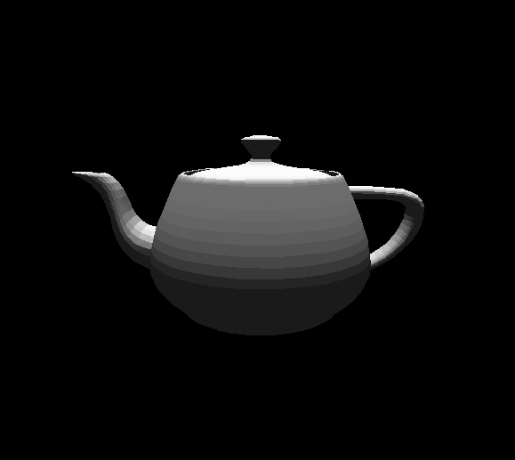

# Node.js 3D Rendering Engine
A node.js and HTML5 based 3d rendering engine loosely based on javidx9's 3d rendering YouTube tutorial.
This requires the node.js package "socket.io" to run properly

## Table of contents
* [General info](#general-info)
* [Languages](#languages)
* [Inspiration](#inspiration)

## General info
This is a 3d rendering engine with a few extra features. It utilizes node.js to create a browser based 3d rendering engine in the HTML5 canvas.
This is a screenshot of the Utah Teapot being rendered using this 3d rendering engine.

This is a screenshot of Boids which I implemented into the 3d rendering engine. Boids is an artificial life program, developed by Craig Reynolds in 1986, which simulates the flocking behaviour of birds. 

### Languages
* Javascript
* HTML5
* CSS

## Inspiration
* javidx9 (OneLoneCoder)
* The Coding Train
