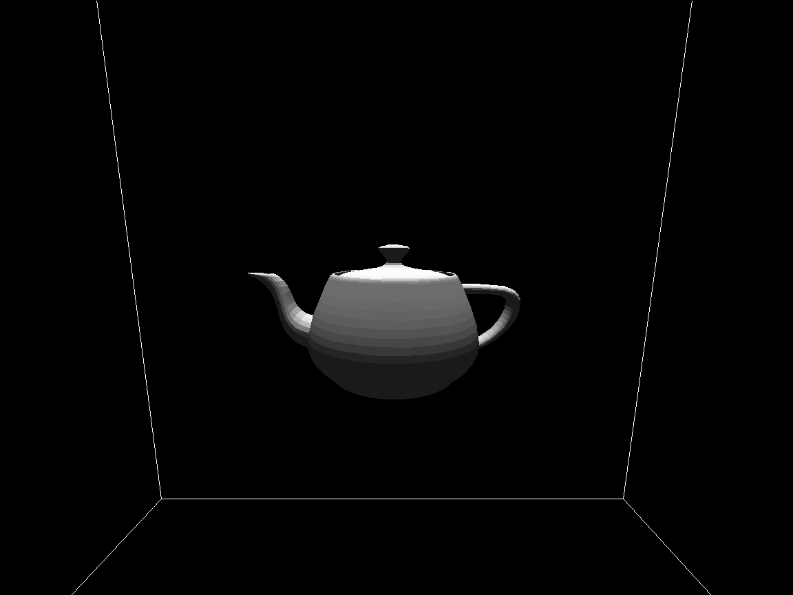

# Node.js 3D Rendering Engine
A node.js and HTML5 based 3d rendering engine loosely based on javidx9's 3d rendering YouTube tutorial.
This requires the node.js package "socket.io" to run properly

## Table of contents
* [General info](#general-info)
* [Languages](#languages)
* [Inspiration](#inspiration)
* [Visuals](#visuals)

## General info
This is a 3d rendering engine with a few extra features. It utilizes node.js to create a browser based 3d rendering engine in the HTML5 canvas. 
I have also implemented [Boids](https://en.wikipedia.org/wiki/Boids), an artificial life program, developed by Craig Reynolds in 1986, which simulates the flocking behaviour of birds. 

### Languages
* Javascript
* HTML5
* CSS

## Inspiration
* [javidx9](https://www.youtube.com/channel/UC-yuWVUplUJZvieEligKBkA) (OneLoneCoder)
* [The Coding Train](https://www.youtube.com/channel/UCvjgXvBlbQiydffZU7m1_aw)

## Visuals
This is a screenshot of the Utah Teapot.

This is a screenshot of Boids.

